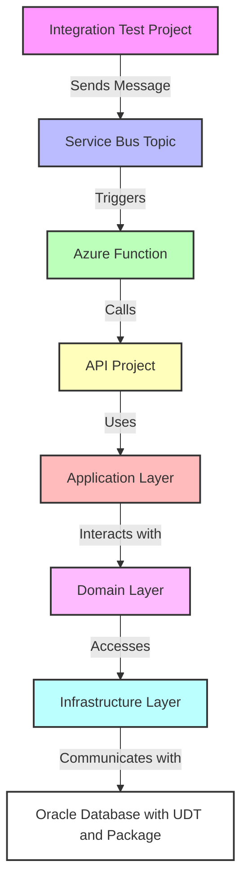

# TableOfUdtOracle
Adding a table of **User Defined Types (UDT)** with an **Oracle Blob column**.
The **UDT** is defined in **Oracle Types** and passed as parameter to a Stored procedure that is defined in an **Oracle package**.  
**Custom types generated with Oracle Developer tools for visual studio 2022**. 
<hr/>

# Why this project?
- Experience with how to send a table of Oracle UDT as parameter to Oracle Stored Procedure defined in a Package.
- Experience with how to make an integration test of an Azure function triggered by a service bus topic message.
- Experience with how to add a local.settings.json in a test project via Dependency injection, by referencing the API project.
- Experience with how to implement an Onion architecture.
- Experience with how to pass media file, Oracle Blob / bytes array to Oracle DB.
- To understand how Oracle Types / UDT and ODP.NET work.  

# How to go ? 
The necessary types definition files and scripts to run used are found in the repository.  
**NB: I'm not the owner of the ressources found in this project like Gaming.jpeg.**

For the prerequisites,

I used Oracle Database Express Edition (XE) 21c, 
Used ODP.NET Managed Driver 21.3.0.0.0 via NuGet packages, referenced in the project.

- Install the Database Oracle XE <a href="https://www.oracle.com/database/technologies/xe-downloads.html" target="_blank">get it here</a>. 
- Download and install Oracle SQL Developer to run the scripts <a href="https://www.oracle.com/database/sqldeveloper/technologies/download/" target="_blank">get it here</a>.
- Create a db user and give it the required privileges.
- Connect to the Oracle Db with the created user via Oracle SQL Developer.
- Make sure the Listener (OracleOraDB21Home1TNSListener) is running in services.msc (if you have that issue trying to connect).
- Connect with the created user before running the scripts (that you adjusted to match the user/schema, replace the schema name C##STEPHANE).
- Run the scripts found in the scripts folder to create the Types (UDT) the package with its body (in that order).
- Open the VS solution, restore the projects, adjust the used schema and package names in the entities and DbContext.
- Connect to the Oracle Db via the VS Server Explorer, by making a new DB connection using ODP.NET Managed configuration.
- Open the integration test project and create a local.settings.json file and add the connection property (ORACLE_DB_CONNECTION_STRING) string from the new connection you made (can be obtained from properties of the DB Connection created).
- Adjust the path to the gaming.jpeg file in the retrieval of the bytes array to match your file to be read and saved in DB.
- Reached here you can run the test in debug and follow the call and save of the data.


# local.settings.json sample for the Integration Test Project
```json
{
  "IsEncrypted": false,
  "Values": {
	"AzureWebJobsStorage": "UseDevelopmentStorage=true",
	"FUNCTIONS_WORKER_RUNTIME": "dotnet",
	"SERVICE_BUS_CONNECTION_STRING": "<your_service_bus_connection_string>",
	"TOPIC_NAME": "sampletopic",
	"SUBSCRIPTION_NAME": "samplesubscription",
	"ORACLE_DB_CONNECTION_STRING": "DATA SOURCE=localhost:1521/xe;TNS_ADMIN=C:\\Users\\User\\Oracle\\network\\admin;PERSIST SECURITY INFO=True;USER ID=\"C##STEPHANE\";PASSWORD=\"your_password\""
  }
}
```

## Architecture Diagram

